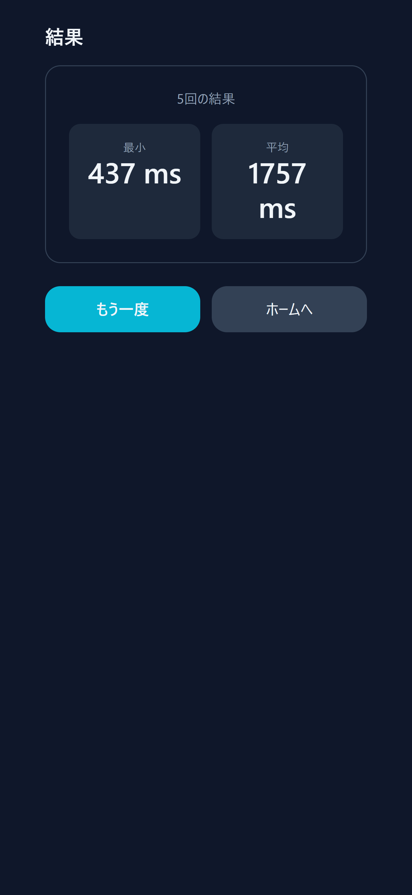

# Quick Reaction Game

<p>
  <a href="https://seiya-matsuoka.github.io/quick-reaction-game/"> 
    
  </a>
  <a href="https://github.com/seiya-matsuoka/quick-reaction-game/actions/workflows/deploy.yml">
    
  </a>
</p>

<p>
  
  
  
</p>

**まばたき / 口の開き / タップ** で反応速度を計測できるリアクションゲーム。  
「合図」に素早く反応してタイムを計測します。

## デモ

公開URL：https://seiya-matsuoka.github.io/quick-reaction-game/

[](https://seiya-matsuoka.github.io/quick-reaction-game/)

## スクリーンショット

<table>
  <tr>
    <td align="center">
      <a href="./docs/screenshot_home_blink.png">
        
      </a><br/><sub>Home（まばたき）</sub>
    </td>
    <td align="center">
      <a href="./docs/screenshot_home_mouth.png">
        
      </a><br/><sub>Home（口の開き）</sub>
    </td>
    <td align="center">
      <a href="./docs/screenshot_praying_camera1.png">
        
      </a><br/><sub>タップで開始</sub>
    </td>
  </tr>
  <tr>
    <td align="center">
      <a href="./docs/screenshot_praying_camera2.png">
        
      </a><br/><sub>合図待ち…</sub>
    </td>
    <td align="center">
      <a href="./docs/screenshot_praying_camera3.png">
        
      </a><br/><sub>今！</sub>
    </td>
    <td align="center">
      <a href="./docs/screenshot_result.png">
        
      </a><br/><sub>結果</sub>
    </td>
  </tr>
  <tr>
    <td align="center">
      <a href="./docs/screenshot_home_tap.png">
        
      </a><br/><sub>Home（タップ）</sub>
    </td>
    <td align="center">
      <a href="./docs/screenshot_praying_tap3.png">
        
      </a><br/><sub>合図待ち…（タップ）</sub>
    </td>
    <td align="center">
      <a href="./docs/screenshot_praying_tap1.png">
        
      </a><br/><sub>早すぎ！</sub>
    </td>
  </tr>
</table>

## 特徴

- **入力モード**：タップ / カメラ
- **カメラ検知**：まばたき / 口の開き（セッション初回のみ手動キャリブ）
- **プレイ回数**：1 / 3 / 5 / 10 回 を設定で選択可
- **ゲーム進行**：ランダムな「合図」を待って反応

## 使い方

1. **入力モード**を選択（既定は「カメラ」 / 検知対象は「まばたき」）。
2. **はじめる** → ゾーンの「**タップでカメラの設定**」を押して初回キャリブ
   - まばたき：**目を開けたまま静止**
   - 口の開き：**口を閉じて静止**
3. キャリブ完了 → 「**タップで開始**」 → 「**合図待ち…**」
4. 「**今！**」の合図後に、選んだ方法で反応（タップ or まばたき / 口の開き）
   - 合図前に反応すると「**早すぎ！**」で仕切り直し（タップのみ）

## セットアップ

```bash
npm i
npm run dev
```

- 本番ビルド：`npm run build`
- プレビュー：`npm run preview`

## 画面構成

- **メインゾーン**：状態表示（カメラ設定 / 合図待ち / 今！ など）と操作
- **カメラプレビュー**：ミラー表示のオン/オフ切替可、検出スコアとしきい値
- **結果表示**：最小/平均/回数などの簡易統計（履歴保存は省略）

## ディレクトリ構成

```bash
src/
├─ components/
│  └─ CameraPreview.tsx     # カメラプレビュー、キャリブ制御
├─ hooks/
│  ├─ useUserMedia.ts       # 共有ストリーム / 権限 / 状態
│  ├─ useGestureDetector.ts # スコア算出・判定
│  └─ useReactionTap.ts     # 反応テスト進行
├─ config/
│  └─ mediapipe.ts          # WASM/モデルURLの取得
├─ types/
│  └─ reaction.ts           # 記録ユーティリティ
├─ App.tsx / main.tsx
└─ index.css
```

## 技術スタック

- **React (Vite)** + **TypeScript**
- **Tailwind CSS v3**
- MediaPipe **Tasks Vision / Face Landmarker**

## セキュリティ / プライバシー

- `https`（または `localhost`）でカメラが使用可能です。ブラウザで権限を許可してください。

## デプロイ（GitHub Pages）

- `vite.config.ts` の `base` を リポジトリ名に設定
- GitHub Actions（`deploy.yml`）が `main` への push で自動デプロイ

  [](https://github.com/seiya-matsuoka/quick-reaction-game/actions/workflows/deploy.yml)
